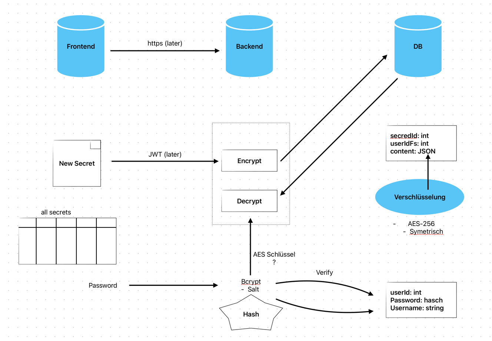

## Encryption Konzept

## Passwort Hashing

### Salt

- Ein Salt ist eine zufällige Zeichenkette, die zu einem Passwort hinzugefügt wird, bevor es gehasht wird und ist pro Benutzer einzigartig.
- Es wird verwendet, um sicherzustellen, dass identische Passwörter unterschiedliche Hashes erzeugen.

### Pepper

- Ein Pepper ist eine geheime Zeichenkette, die zu einem Passwort hinzugefügt wird, bevor es gehasht wird und ist für alle Benutzer gleich.
- Das Pepper is in der Anwendung gespeichert und wird nicht in der Datenbank gespeichert.
- Es wird verwendet, um sicherzustellen, dass selbst wenn ein Angreifer Zugriff auf die Datenbank hat, er die Passwörter nicht entschlüsseln kann, da er nicht über den Pepper verfügt.

### Implementierung

Ich lade das Pepper aus der Konfiguration, das Salt benutze ich vom gefundenen User und benutze sie, um das Passwort zu hashen.
Die reihenfolge ist: salt + password + pepper

## Encryption

- AES (Advanced Encryption Standard)
- AES ist ein symmetrischer Verschlüsselungsalgorithmus, der einen geheimen Schlüssel verwendet, um Daten zu verschlüsseln und zu entschlüsseln.
- Ich benutze für das Password den MasterKey mit dem Salt des Benutzers.
- Der MasterKey lade ich aus der Konfiguration.

## ReCAPTCHA
- ReCAPTCHA ist ein Dienst von Google, der verwendet wird, um sicherzustellen, dass ein Benutzer ein Mensch und kein Bot ist.
- Es wird verwendet, um zu verhindern, dass automatisierte Angriffe auf die Anwendung durchgeführt werden.

## Passwort Policy
- Die Passwort Policy legt fest, welche Anforderungen an Passwörter gestellt werden müssen, um die Sicherheit zu erhöhen.
- Die Passwort Policy kann folgende Anforderungen enthalten:
  - Mindestlänge des Passworts
  - Verwendung von Gross- und Kleinbuchstaben
  - Verwendung von Zahlen
  - Verwendung von Sonderzeichen

## Passwort Reset
- Der Passwort Reset ist ein Prozess, der es einem Benutzer ermöglicht, sein Passwort zurückzusetzen, wenn er es vergessen hat.
- Diese Schritte werden durchgeführt:
  1. Der Benutzer gibt seine E-Mail-Adresse ein.
  2. Ein Link zum Zurücksetzen des Passworts wird an die E-Mail-Adresse gesendet über SendGrid.
  3. Der Benutzer klickt auf den Link und wird zu einer Seite weitergeleitet, auf der er ein neues Passwort eingeben kann.
  4. Das neue Passwort wird gehasht und in der Datenbank gespeichert.

## JWT (JSON Web Token)
- Nach Login wird ein JWT erstellt.
- Enthält Benutzer-ID, E-Mail und Rollen.
- Wird im Frontend gespeichert und bei API-Anfragen mitgesendet.
- Dient zur Authentifizierung und Autorisierung im Backend.
- Der Token wird im Frontend im LocalStorage gespeichert und bei API-Anfragen im Authorization-Header mitgesendet.
- Das Backend prüft und validiert den JWT bei jedem geschützten API-Aufruf, um die Identität und Berechtigungen des Benutzers zu überprüfen.
- Die Gültigkeit des Tokens ist zeitlich begrenzt (Ablaufzeit im Token enthalten).

## OAuth2 Login mit Google
- OAuth2 ist ein offener Standard für Autorisierung, der es Benutzern ermöglicht, sich mit einem bestehenden Google-Konto sicher anzumelden, ohne ein neues Passwort zu erstellen.
- Die app bietet einen "Login mit Google"-Button auf der Login-Seite.
- Nach Klick auf den Button wird der Benutzer zu Google weitergeleitet, um die Anmeldung zu bestätigen.
- Nach Authentifizierung sendet Google die Benutzerinformationen an die app zurück.
- Die app erstellt daraufhin einen eigenen JWT-Token, der die E-Mail und Rollen des Benutzers enthält.
- Der Benutzer ist nun eingeloggt und kann die app nutzen, ohne ein separates Passwort zu benötigen.
- Neue Google-Nutzer werden beim ersten Login automatisch als Benutzer in der Datenbank angelegt.